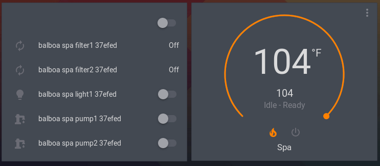

# Balboa Spa integration for home-assistant
Home assistant integration for a Balboa spa wifi controller.

## Configuration

There is a config flow for the spa.  After installing, 
go to integrations, hit + to setup a new integration, search for "Balboa Spa",
select that, and add the IP address or hostname of your spa's wifi adapter.

If you have a blower, it will be listed as a "fan" in the climate device for
the spa.  Currently the code assumes you have a 3-speed blower, if you only
have a 1-speed, only use LOW and OFF.

## Screenshot

## See also

<https://github.com/natekspencer/pybalboa>
